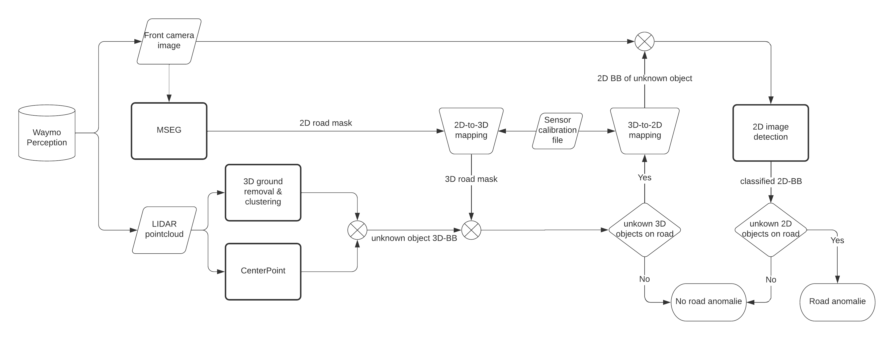

# Unknown Detection Road

Title: Detection of unknown objects on roads
Method: Object detection, lane detection, semantic segmentation
Topic: To scale autonomous vehicles from small testing regions to the whole world, the reliability of machine learning systems is critical, especially regarding object detection for such which are in proximity to the planned trajectory of an autonomous vehicle. Therefore, this lab topic covers three main tasks:

- Detect lanes and the available driving area on image & lidar data to determine relevant positions in the environment.
- Detect clusters in lidar point clouds within these regions and classify them, if possible.
- For clusters that the lidar cannot classify, project the lidar points into the image space and try to detect an object within this ROI in the image space.

If this fails, a so-called corner case is detected, where an unknown object is detected in a relevant position. Such a system can be used online to detect challenging scenarios or offline as part of an active learning pipeline. This lab project will start with publicly available datasets. Frequently though, these do not contain enough interesting data. Therefore, after analyzing available datasets, it will be determined if a simulation of relevant scenes will be performed in the simulation environment CARLA.

## Distribution of Tasks

Task 1: Detect lanes and the available driving area on image & lidar data to determine relevant positions in the environment - Christin Scheib

Task 2: Detect clusters in lidar point clouds within these regions and classify them, if possible -  Maximilian Nitsche

Task 3: For clusters that the lidar cannot classify, project the lidar points into the image space and try to detect an object within this ROI in the image space - Enrico Eisen

## How to use the code
### Semantic Segmentation 
1. Clone this repo
2. Navigate to the folder /test/mseg-semantic
3. Install the mseg_semantic module by running `$ pip install -e ./mseg_semantic`. 
Make sure that you can run `$ python -c "import mseg_semantic; print('hello world')"` in python
4. Navigate to the folder /mseg_semantic/mseg-api
5. Install the mseg module by running `$ pip install -e ./mseg_semantic/mseg-api`. Check if the module was properly installed by running `import mseg`.
6. Use the pre-trained model mseg-3m.pth for inference
7. For each image that is infered the model will save road coordinates. Change the path where these are saved in the file mseg-api/mseg/utils/mask_utils_detectron2.py in line 519-522. 
8. Run inference on a datasets
`$ python -u mseg_semantic/tool/universal_demo.py    --config=mseg_semantic/config/test/default_config_360_ms.yaml model_name mseg-3m model_path '/path_to_model/mseg-3m.pth' input_file '/path_to_dataset/'`
9. As the road coordinates are given in camera coordinates they need to be tranformed into the 3D-lidar space. Run `$ python waymo_mapping_clean.py`. Make sure the paths given in lines 49-52 are the correct ones. The road masks are gonna be saved under the path specified in line 139. 

### Preprocessing, clustering and 3D-point cloud prediction

1. Install CenterPoint following the [install documentation](https://github.com/tianweiy/CenterPoint/blob/master/docs/INSTALL.md)
2. Run inference on a dataset and create a prediction file in the folder "results" following e.g. the waymo docs [waymo documentation](https://github.com/tianweiy/CenterPoint/blob/master/docs/WAYMO.md)
3. Run the clustering and bounding box alignment `$ python clustering/cluster.py --road_path results/road_mask --lidar_path results/lidar --prediction_path results/detection_pred.pkl --output_path results` (or use the already setup VS Code tasks [here](.vscode/launch.json))
4. Visualization of 3D anomaly detection results `$ python clustering/visualize.py --root_path results --prediction_path results/detection_pred.pkl --online` (or use the already setup VS Code tasks [here](.vscode/launch.json)

5. Visualization of pipeline results `$ python visualize_pipeline.py --root_path results/visualizations --online` (or use the already setup VS Code tasks [here](.vscode/launch.json)
